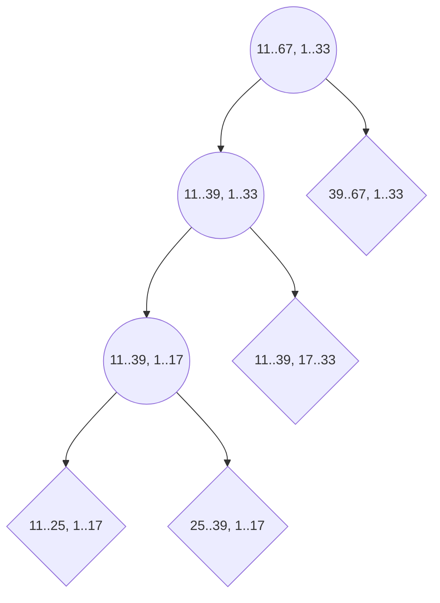

# Using Isolation Forest as a Novelty Detection tool - work title

## Abstract
- téma
- toto jsme udělali
- co řešíme
- takto
- takto jsme to otestovali
- toto je výsledek
## Introduction
- start with lots of refs
- describe the problem
- our main goal was to
- general -> specific (describe problem as a whole, then why the problems occurs, then why is it a problem for us, technical details, env. variables)
- constribution
- **toto až nakonec až budeme vědět co vlastně fungovalo**
- **here we describe the domain!! - aneb jak ta data vypadají - co je cílem hlavně vysvětlit čeho jsme chtěli dosáhnout**
 
## SOTA
- [ ] TODO: zde ze scikitu apod články na novelty detection algoritmy, stěmi to pak budeme porovnávat
https://scikit-learn.org/stable/modules/outlier_detection.html#novelty-detection
https://scikit-learn.org/stable/modules/outlier_detection.html#novelty-detection-with-local-outlier-factor

http://proceedings.mlr.press/v5/smola09a/smola09a.pdf

One of the successful methods dealing with novelty detection is OneClass SVM algorithm (10.1162/089976601750264965). 
#### One-class SVM novelty
The One-class SVM algorithm is the unsupervised outlier detection algorithm which can also be used for novelty detection.
It computes (optimizes) a binary function which is supposed to capture regions in input space where the probability density lives (its support), i.e., a function such that most of the data will live in the region where the function is nonzero (Schölkopf et al., 1999). 

Another method, initially used for unsupervised outlier detection but capable of being used as a novelty detection is the Local Outlier Factor algorithm.
#### Local Outlier Factor
The Local Outlier Factor (LOF) algorithm (https://doi.org/10.1145/335191.335388) assigns each point in the dataset a degree of outlier-ness.
Whereas previous attempts assigned datapoints a binary property (outlier/not), LOF algorithm assigns a real value, following a k-distance neighborhood. 
It first calculates the reachability distance from all the neighbors.
Based on this, the algorithm calculates the LOF score of the point and compares with the threshold.
This is done for all of the points until each point has its own LOF score.
When using this method for novelty detection, the novelty decision function is shifted opposite (large values correspond to inliers, whereas small values are novel datapoints).

#### Isolation Forest
Isolation forest on the other hand, has been widely used for outlier detection. 
In (https://doi.org/10.1016/j.patrec.2022.09.015) Xu, Yang and Rahardja show Isolation Forest outperforming other 12 state-of-the-art outlier detectors by running the experiments on public outlier detection datasets.
Thorough the years, many successful enhancements of the Isolation Forest have been developed. Gałka, Karczmarek, Tokovarov in (https://doi.org/10.1016/j.patrec.2022.09.015) implement Minimal Spanning Tree clustering-based enhancement.
Instead of random determination of a split point, first, two clusters are prepared and then a split point is set to the middle of prepared clusters. Another interesting enhancement comes from Chater and al. (https://doi.org/10.1016/j.procs.2022.09.147) where the team deal with the necessity of having precise and crisp data when using basic Isolation Forest approach by implementing Fuzzy adaptation for the Isolation Forest.
However, there does not seem to be much work regarding using Isolation Forest as a novelty detection tool. 

## Theory
Datapoint
: Datapoint is any observable data with $n$ features.

Regular
: Regular is a datapoint included in the given dataset. Its features are expectable.

Anomaly
: Anomaly is a datapoint, that differs significantly from other observations.

Outlier
: Outlier is an anomaly included in the given dataset. 

Novelty
: Novelty is an anomaly that is not present in the given dataset during learning. Novelties are usually supplied later during evaluation.

Supervised algortihm
: Supervised algorithm is to je to co chceme aby to bylo

Unsupervised algortihm
: Supervised algorithm is to je to co chceme aby to bylo

Semisupervised algortihm
: Semi-supervised algorithm to je že máš labely jen napůl a chceš vědět které nedopovídají labelu

## Methods

Traditional approaches for anomaly detection consist of either novelty detection or outlier detection.
Novelty detection is an anomaly detection mechanism, where we search for unusual observations, which are discovered due to their differences from the training data.
Novelty detection is a semi-supervised anomaly detection technique, whereas outlier detection uses unsupervised methods.
With novelty detection, the training data is not polluted by anomalous elements, and we are interested in detecting whether a new observation is an anomaly. 
In this context such points are also called novelties.
This is a crucial distinction. 
The outlier detection is usually presented with data containing both anomalies and regular observation, it then uses mathematical models that try to make distinction between them. 
The novelty detection on the other hand is usually presented data with little to zero anomalies (the proportion of anomalies in the dataset is called a contamination) and later, when conferred with an anomalous observation, it makes a decision. 

Consider the following example:
Figure X contains random datapoints arranged in a way they form a cluster like shape. 
Say this data is our regular observations. 
 
> Figure 0 Dataset with regular observations. 

When an unsupervised, outlier detection algorithm tries to analyze such data, it sees the datapoints as a cluster containing both regular and anomalous observations. 
Figure X shows the result of evaluating classical Isolation Forest on such dataset.

 
> Figure 0.5 Dataset with regular observations. 

Figure x shows regular observations $x$ and anomaly observations $y$ marked by Isolation Forest (`batch_size 128, trees_count: 100, zbytek default`). 
Figure x shows that approx. $10\%$ of observations are anomalies.
This is not unwanted behavior in the sense of outlier detection but is false positive observation in the sense of novelty detection, because this data are regular observations which should be marked so.

Another problem is with the unsupervised separation itself.
Consider data polluted by anomalies in close to $1:1$ ratio.
Finding the line itself is obvious.
Deciding which observations are anomalies, without some domain knowledge on the other hand is close to impossible.

### Isolation Forest
Isolation Forest ([1](https://doi.org/10.1016/j.engappai.2022.105730 "article 1"), [2](https://doi.org/10.1016/j.patcog.2023.109334 "article 2")) is an outlier detection, unsupervised ensemble algorithm. 
This approach is well known to successfully isolate outliers by using recursive partitioning (forming a tree-like structure) to decide whether the analyzed datapoint is an anomaly or not.
The less partitions required to isolate the more probable it is for a datapoint to be an anomaly.

- [ ] TODO: Honza tu vysvětlí jak funguje isolation forest, popíše všechny parametry a co dělají
      
#### Isolation Tree
Isolation tree je kořenový binární strom sestaven na základě vybrané podmnožiny $A$ prvků (bodů) o velikosti $s=|A|$.

Isolation Tree is a binary tree constructed with a subset of $A$ items (datapoints) with the size $s=|A|$.

1. To build an isolation tree it is not necessary to have a large set; it may even be undesirable
2. Well-chosen small $s$ can help eliminate *masking* and *swamping*

   masking 
   : When the number of anomalies is high it is possible that some of those aggregate in a dense and large cluster, making it more difficult to separate the single anomalies and, in turn, to detect such points as anomalous.
   
   swamping
   : When normal instances are too close to anomalies, the number of partitions required to separate anomalies increases, which makes it more difficult for the Isolation Forest to discriminate between anomalies and normal points
3. There are two types of vertices
   
   internal vertex
   : contains a condition (a feature and a limit) and two children (one representing a fulfilled condition and the other an unfulfilled one)
  
   external vertex (leaf)
   : it is created if the conditions of the parents are met (or not met) by one or none of the elements from the sample, or the maximum depth of the tree $l$ is reached, usually $l=\ln_2(s)$. It contains the evaluation of $h(x)$ using the distance from the root. If the max length of the tree is reached the *distance* is estimated using $h(x)=e+c(n)$, where $e$ is the distance from the root, $n$ is the number of elements from the sample satisfying the conditions of the parents, $c(n)=2\,(H_{n-1}-\frac{n-1}{n})$ and $H_{n-1}$ is $n-1$ harmonic number.
 

   
- [ ] TODO: Honza to tu vysvětlí obecně.
- [ ] TODO: další možnost výzkumu (jinej článek) jak udělat isolation forest, 
  když data (features) nebudou hodnoty z intervalu, ale třeba hodnoty z konečné podmnožiny 

### Proposed novelty isolation forest enhancement
#### Initial problem
In this section, we propose a new enhancement of the original Isolation Forest algorithm for making it possible to detect novelty observations. 
The proposed enhancement takes the basic idea of an ensemble of trees with various depths but is taking it further to make supervised novelty detection possible.
The standard Isolation Forest algorithm cannot be used for novelty detection.
This is because in each step, it limits the observation with the previously separated data.

Consider *regular* observations known to the Isolation Forest algorithm a priory and *anomaly* the novelty datapoints provided later. 
The standard Isolation Forest algorithm as defined by Liu et. al. selects the split point based on the min-max value according to a priory datapoints.

Example X - Outlier detection using Isolation Forest:
Consider the sample of abnormal datapoints, which can be seen on the Figure X.
These datapoints are marked Px.
Example X in Figure X shows the outcome of the Isolation Forest algorithm with `max_depth=4` when provided a priory *regular* data points.
First, random dimension $X$ and a random split point approx. $s  = 21$ are chosen, orphaning most of the observations on the left side.
In the second step, in the right area, feature $Y$ was chosen, splitting the area in two parts. Observe, that the split point is always located between area-datapoint's minimum and maximum of the given feature.
Observe also, that the split point only separates the area where the minmax -outlier are should be evaluated. 
Hence, as in a binary tree, on each side of a split point the algorithm tries to find exactly one area that would be bounded by the input's minmax.
Such area is assigned a depth, which is equal to the node's depth in a binary tree (note that when the max depth is reached, a depth evaluation is taking place).
Figure X shows that the outlying Px points are not marked as outlier.
This is caused by the points being outside the scope of any minmax-bounding rectangle (outside the scope of the node), hence fall backing to the node with the most similar values.
As can be seen in Figure X, this is inappropriate for the novelty selection.

 
> Figure X Isolation Forest blabla.

On the other hand, when Px is located within the area of lower depth, it is safely assigned regular.

 
> Figure X Isolation Forest blabla.

The common misunderstanding is that the Isolation Forest isolates all of the datapoints based on the split point.
This is, however, just a part of the algorithm.
The Isolation Forest isolates the minmax area on the left/right side of the split point based on the datapoints provided in the respective area.
If the evaluated datapoints or the whole area is out of the bounds of the isolation, this area is not immediately assigned outlier.
Instead, the area is not seen by the algorithm at all and hence is marked the same as the nearest points.
This is undesirable in the context of novelty detection, since every novelty datapoint would have been assigned according to the nearest points, even though the distance would be marginal.

Consider a more robust example, where the observed area is polluted by regular observations on the one side, regular on the other side and polluted by the novelty datapoints in the middle.
This is a demanding task for the outlier detection algorithm; hence the points are located between the regular nodes.
Figure X shows the outlier algorithm experiment with the novelty datapoints in the middle marked regular.
Observe, that the outlying points around the observed area are still being correctly marked.

 
> Figure X Isolation Forest blabla.

In our proposed solution, this problem is dealt with by isolating whole ranges of observed space, instead just the minmax values.

#### Proposed solution
The proposed solution comes from an idea, that the original tree lacks the possibility to isolate more datapoints than it currently observes. 
The observed space is bounded by minimum and maximum in each feature.

Consider now an area of datapoints PX.
Figure X shows that the whole space is considered a range and the range is now splitting 

> Figure X Isolation Forest novelty point insertion using our novelty approach. Squares being points fed after the learning. 

As in the original article, we use the concept of a binary decision tree.
The proposed solution is altering the concept of the split point evaluation.
Whereas the original Isolation Forest is evaluating the split point based on the previous data, in our proposed solution we evaluate the split point based on a range.
For this to work, several alterations to the split point evaluation and the form of data passed between vertices has to be done however, the overall concept of the forest stays the same. 

In the proposed solution, there are two main alteration concepts to the original solution.

 1. Each of the vertices gets assigned a space bounded by ranges.\
Each range should be reasonable enough to allow all the domain space to be separated correctly, hence some tolerance is needed.

 3. The split point is in the middle of the given feature's *range*.
 4. The input observations are only used to detect leaves.

- [ ] TODO: Teorie grafů

In the following we suppose a Euclidean type of space.

Let us construct the decision tree such that:
- maximal possible height of a tree is controlled by the *max_depth* parameter
- the sample $S$ contains *batch_size* number of input datapoints.
- leaves and internal vertices are possibility-space hyperrectangles $R$.
- leaves' ending condition is satisfied by one of two criterions:
  1. leaf is left with space $R$ such that $S \cap R = \emptyset$ or $| S \cap R | = 1$
  2. leaf's depth reached the *max_depth* value

##### Basis step

For each $i \in\{1, \dots, n\}$
, dimension $d_i$ is bounded by the range $r_i$. The ranges form the possibility-space hyperrectangle $R_0$ as in (xx). 
$$R_0 =  r_1 \times r_2 \times \cdots \times r_n  \tag{xx}$$

The only root vertex $R_0$ is a trivial binary tree $T_0$ with vertices $V_0 = \{R_0\}$ and edges $E_0 = \emptyset$, i.e.
$$T_0= (V_0, E_0) = (\{R_0\},\emptyset).$$ 

##### Recursive step
 
The steps to reach the tree $T_{j+1}$ from $T_{j}$ are as follows:

Let $L_j \subseteq V_j$ be a subset of leaves not satisfying the ending condition.
If $L_j = \emptyset$, do not continue further.

For each leaf $R \in L_j$ create two new vertices $R_l, R_r$ by selecting a random dimension $d$.

Let 
$$R = r_1 \times  \cdots \times r_{d-1} \times  r_d\times r_{d+1} \times \cdots \times r_n  \tag{x}$$
and $r_d = \langle x, y )$.

Then we obtain the left and right hyperrectangles $R_l$, $R_r$ as follows:  $$R_l = r_1 \times  \cdots \times r_{d-1} \times  r_l \times r_{d+1} \times \cdots \times r_n  \tag{x}$$

$$R_r = r_1 \times  \cdots \times r_{d-1} \times  r_r \times r_{d+1} \times \cdots \times r_n  \tag{x}$$
where $r_l =  \langle x, s )$ and  $r_r =  \langle s, 
y )$ and $s$ is a number obtained as the middle of the range $r_d\,$:

$$s = \frac{x + y}{2}\tag{x}.$$
Each vertex $R$ is assigned two new edges $(R,R_l ), (R, R_r)$ as in (x...xxx).

$$V_{j+1} = V_j \cup \bigcup_{R \in L_j} \{R_l, R_r\}, \tag{x}$$
$$E_{j+1} = E_j \cup \bigcup_{R \in L_j} \{(R, R_l), (R,R_r)\}, \tag{xx}$$
$$T_{j+1} = (V_{j+1}, E_{j+1}) \tag{xxx},$$
i.e. $R_l$ is the left leaf of $R$ and $R_r$ right leaf of $R$ in the new tree $T_{j+1}$. 

Note: Tree $T_{j}$ is actually a Hasse diagram of the ordered set $(V_j,\subseteq)$.

Example x shows the Isolation Tree diagram of an example from the Figure X.

> Figure X. Isolation Tree diagram for figure X.
 

### evaluate tree
Now, with the tree constructed, we can move on to the evaluation part.
The goal of the evaluation is to get the novelty value of a datapoint.
The evaluation phasis starts with a constructed tree and the datapoint recursively traverses from the root down the tree up to the leaf so that:

1. The datapoint traverses left, if it fits into the possibility space of the left vertex
2. The datapoint traverses right, if it fits into the possibility space of the right vertex

As the datapoint reaches the leaf its path_length is calculated as follows:
+ If the first stopping criterion is satisfied, the path_length is the depth of the leaf.
+ Otherwise (max_depth is reached), path_length $h(x)$ is obtained as in
$$h(x)=e+c(n),$$
where $e$ is the depth of the current leaf (max_depth in this case), and $n$ is the size of sample $S$ fitting into possibility space $R$, i.e., $n=| S \cap R |>1$,  and $c(n)$ is obtained using harmonic number $H_{n-1}$ such that $c(n)=2\,(H_{n-1}-\frac{n-1}{n})$. 

Consider the example from Figure X.
Suppose the evaluation of datapoint $P_a = [28,16]$:
- In the first step, the point fits into the possibilty space of the left vertex $\langle 11,39 ) \times \langle 1,33)$
- In the second step, the point fits into the space of a left vertex $\langle 11,39 ) \times \langle 1,17)$
- in the final step, the point fits into the space of a right leaf $\langle 25,39 ) \times \langle 1,17)$, satisfying the first stopping criterion
- the path_length is obtained as depth of a leaf as $h(P_a) = 3$.

Suppose the evaluation of datapoint $P_b = [18,5]$ on the tree  constructed with sample $|S| = 4$:

- [ ] todo: Honza dá Pb do obrazku

Traversing the tree, the datapoint reaches the leaf  $\langle 11,25 ) \times \langle 1,17)$, satisfying the second stopping criterion
- the path_length is obtained as $h_T(P_b) = 3 + c(4) = 3+ 2 \cdot (H_3 - \frac{3}{4}) = 3 +2 \cdot [\bigl(1 + \frac{1}{2} + \frac{1}{3}\bigr) - \frac{3}{4}] = \frac{31}{6}$

### From a tree to the forest
Due to the random selection of samples and a dimension, the evaluation is distributed to the set of trees - a forest.
Basic and recursive steps are repeated for each of the trees in a forest.
The number of trees is set experimentally, usually around 100.

Let forest $F$ be the set of trees $F =(T_1, T_2 \dots ,T_k)$. The expected value $E$ of path_lengths $h_T(X)$  for the respective tress $T_i$ is obtained as
$$E(h(X)) = \frac{h_{T_1}(X) + h_{T_2}(X) + \cdots + h_{T_k}(X)}{k} .$$

The novelty score $s_F(X)$ is then
$$s_F(X) = 	2^{-\frac{E(h(X))}{c(X)}}.$$

Consider the following example.

#begin další článek
-------------------

As a baseline, we select range by constructing a box plot, using interquartile range (1).

$$IQR = Q_3 - Q_1 = q_{.75} - q_{.25} \qquad (1)$$,
where $Q_1$ is the first quartile (also defined as 75th percentile) and $Q_3$ second quartile (also defined as 25th percentile).

#### Range tolerance selection
I addition to this, we need to add a tolerance layer to contain the later observed novelties.
This is usually done by adding a set of whiskers to a box plot.
The most straightforward selection of the whiskers is the min-max of the dataset.
This is not desired since the min-max would not cover possible later anomalies.
Instead, two other variations are tested, the *Notched box* and the *Adjusted box*.
##### Notched box
Notched box plots apply a "notch" or narrowing of the box around the median. 
Notches are useful in offering a rough guide of the significance of the difference of medians; if the notches of two boxes do not overlap, this will provide evidence of a statistically significant difference between the medians.

Let *n* be the amount of data, the boundaries of the notches around the median can be obtained as in (2).

$$f(x) = \pm \frac{1.58IQR}{\sqrt{n}} \qquad (2)$$

##### Adjusted box
Adjusted box is useful for describing the skew distributions.
It relies on the *medcouple* value (MC) of the dataset.
The *medcouple* is a statistic to measure the skewness (asymmetry of the prop. distribution) of a univariate distribution. 
As of Humert et. al (https://www.sciencedirect.com/science/article/pii/S0167947307004434?via%3Dihub)
for a medcouple value of MC, the lengths of the upper and lower whiskers on the box-plot are respectively defined in (3).

$$
f(x)= 
   \begin{cases}
    [Q_1 - 1.5\,IQR \cdot e^{-4\,MC},  Q_3 + 1.5\,IQR \cdot e^{3\,MC}],& \text{if } MC\geq 0\\
    [Q_1 - 1.5\,IQR \cdot e^{-3\,MC},  Q_3 + 1.5\,IQR \cdot e^{4\,MC}],& \text{if } MC\leq 0
	\end{cases}
	\tag{3}
$$

for symmetrical distributions, the MC value being zero, after substitution we get:

$$f_{MC_0}(x)=1.5\,IQR \tag{4}$$

Using above defined functions, the range is generated for each of the dimensions of the dataset.

#end další článek
------------

##### Implementation

For the ease of implementing and experimenting, we created a Ruby Gem implementing the Isolation Forest algorithm. It is open-source and available online at.
- [ ] TODO: šup sem odkaz na ruby algoritmus s dokumentací

The standard Isolation Forest service can be found in the standalone package at. 
- [ ] TODO: šup sem odkaz na ruby algoritmus s dokumentací

The appropriate choice of the algorithm for the range tolerance selection is a matter of experiments and future research.

In this section we describe the Isolation Forest, pinpointing the changes made by Novelty Service.

This is demonstrated by a new service (TODO: odkaz) which was created by modifying the standard the Isolation Forest implementation in [odkaz na kapitolu].
 
 We encourage you to try it and maybe create your own service based on our already implemented ones.

First, the correct hyperparameters setting is needed in order to properly use the Novelty service.
For the Novelty service to work, it is necessary to set the following set of attributes:
These attributes apply to a single tree.

batch_size
: Each of the trees gets assigned a random sample of *batch_size* datapoints. 

ranges
 : An appropriate range of values for each of the features of a dataset. 

max_depth
: The maximum depth of a tree. 
Stopping criterion.
For high-dimensionality problems it is advised to be set a higher value than in the standard implementation.
Matter of a future research.

Moreover, the number of trees can be set during the Forest initialization.

trees
: The number of trees of a forest. 

- [ ] TODO: nuance oproti teorii

We begin with a dataset of regular, conceivably little contaminated observations and a set of above defined parameters.
Out of these observations, the set $B$ of *batch_size* items is selected.
 

begin jiny clanek/diskuze
---------
where $r_f$ being a random range generated using one of the above-defined functions and D being all of the dimensions of a given dataset.
This is due to a fact that individual dimensions can differ in their statistical distributions.

end jiny clanek/diskuze
----

## Experiments

The Scikit-Learn platform (scikit-learn.org) offers several implemented, documented and tested machine-learning open-source algorithms.

- [ ] TODO: TADY JEN NAPÍŠEME NĚJAKÉ KECY ŽE JSME POUŽILI AUTOKONFIGURACI PRO NASTAVENÍ RANGES, jinak další článek

- [ ] TODO:  popíšeme že scikit má nějaké novelty detection algortimy, budeme to s nimi porovnávat
- [ ] TODO:  popíšeme že challenge je dobře nastavit hyperparametry

This kind of issue is widely known amongst AutoML community.
Some tools have already been implemented that try to deal with the issue of automatic hyperparameter tuning, namely H20 (h2o.ai) or AutoGluon (auto.gluon.ai). 

- [ ] TODO: prvně bychom měli vyhodnotit experimenty s odchylkou

| statistics:          | http.csv | shuttle.csv |   |   |
|----------------------|--------|-------|---|---|
| % anomalies/ % found |        |       |   |   |
| % false positive     |        |       |   |   |
|                      |        |       |   |   |

- [ ] TODO: tady experimenty, heatmapa atp., nějaký SOTA novelty algoritmus ze scikitu na porovnání

- [ ] TODO: přídáme i porovnání s bin/simple_novelty.rb
SVM: http.csv - anomalie všechny, ale pulku regularů označil jako ochylky
SVM: shuttle.csv - najde anomalie správně, ale pulku regularů označí jako anomálie
simple_novelty : http.csv - hodně dobře funguje, až moc
simple_novelty: shuttle.csv - nic moc
naše novelty: http.csv - slušné
naše novelty: shuttle.csv - horší ale OK
lof: http.csv - super
lof: shuttle.csv - super

 
### automl hyperparameter tuning for IF - v jinem članku

## Results and discussion
- tady můžeme zkusit tabulku kde budeme ukazovat kolik procent novelty to našlo apt možná porovnání s nějakým buď expertem nebo nějakými referenčními olabelovanými daty
- zde napíšeme co se povedlo, jak to neni vubec lehke najit dva či více algoritmů které spolu dobře fungují a velký problem je jejich validace a verifikace, zkus navhrnout nějaké řešení verifikace

## Drawbacks, todos
-  [ ] TODO: TADY POPIŠ například ŽE PRO MOC DIMENZÍ KDYŽ BY JICH BYLO HODNĚ STEJNÝCH TAK JE TO NAPRD, když by se to lišilo jen v jedné tak je to naprd...

## Conclusion

<!--stackedit_data:
eyJoaXN0b3J5IjpbLTEyODA2MTQ4NSwtMzM3ODQ5NDQ1LC0xOT
QxMjUxMzE4LC02MDA3MzI3MjIsLTE2NzY4NDkzNzUsMTE2MDYz
MTkwMSwxMjAxODIxNTEzLC0xMDM4MDAxMzkwLC0xMTE4NjQ5NT
EyLC02ODAzNDQ3NDQsNjY4MDMwODYsLTE1ODk2MTU1MDEsLTE3
NDc1NTMwMTcsLTk0NDY0MDAyNSwtMzg1MTkzNDk1LC00OTk3Mz
E2MjUsLTEyMzUyOTI0MDgsMjUxMDIzNzg4LDIwMzA0OTA1Nzgs
NDU4MDUzMjQwXX0=
-->